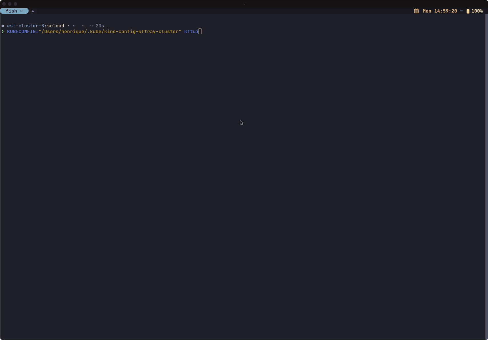

# Kubernetes Local Cluster with Kind, Terraform and Kftray Annotations


[](https://github.com/hcavarsan/kftray)


## Overview

This project provides a simple way to build a Kubernetes (k8s) cluster. It automates the bootstrap process for a local k8s cluster and uses [Kind (Kubernetes IN Docker)](https://kind.sigs.k8s.io/), `Terraform`, and Helm to set up `ArgoCD`, `Prometheus`, `Alertmanager`, `Grafana`, and `Jaeger`. Additionally, it automatically configures kubectl port forwarding via [Kftray](https://github.com/hcavarsan/kftray) based on service annotations.

## Why?

In some cases, there is no need of Ingress controllers or exposed services with NodePort/LoadBalancer,  What happens in this setup is that everything stays inside the cluster, thus making the environment safer and simpler. All external traffic is tunneled through kubectl port-forward on localhost via kftray.

## Bootstrapping the stack

Before you begin, make sure you have these installed on your computer:

- [Docker](https://www.docker.com/get-started)
- [Terraform (v1.9.5)](https://www.terraform.io/downloads.html)
- [Kftray](https://github.com/hcavarsan/kftray) - you can choose beetwen kftray (GUI) or kftui (TUI)

### 1. Terraform

To bootstrap all the k8s cluster stack, just clone this repository and run terrarform:

```bash
git clone https://github.com/hcavarsan/kftray-k8s-tf-example
cd kftray-k8s-tf-example/terraform
make apply
```

### 2. Install Kftray

Access the [Kftray GitHub page](https://github.com/hcavarsan/kftray) and follow the installation instructions.

### 3. Import kubectl port-forward configurations in kftray

Once 'terraform apply' finishes, follow these steps:

1. Open Kftray and click the tray icon to open the main window.
2. Click the menu icon in the bottom left corner.
3. Select **"Auto Import"**.
4. Click **"Set kubeconfig"** and choose the kubeconfig file created by Terraform (like `~/.kube/kind-config-kftray-cluster`).
5. Select the right context (e.g., `kftray-cluster`) from the dropdown.
6. Click **"Import"** to load the port forwarding settings automatically.


After importing, you can start port forwarding by toggling the switch next to each service in Kftray or simply click **"Start All"** to forward everything at once.

  <a href="https://github.com/hcavarsan/kftray">
    
  </a>


Or, you can do the same in kftui if you prefer a terminal user interface:

1. Export the KUBECONFIG environment variable and start kftui:
   `KUBECONFIG="~/.kube/kind-config-kftray-cluster" kftui`
2. Press Tab to access the top menu and select `Auto Import`
3. Select all configs by pressing Ctrl+A.
4. Press F to start all port forwards.

  <a href="https://github.com/hcavarsan/kftray">
    
  </a>


### 4. Access Your Services

With Kftray managing the port forwarding, you can access your services locally at the following URLs:

- **Argo CD:** [http://localhost:16080](http://localhost:16080)
- **Prometheus:** [http://localhost:19090](http://localhost:19090)
- **Alertmanager:** [http://localhost:19090](http://localhost:19093)
- **Grafana:** [http://localhost:13080](http://localhost:13080)
- **Jaeger:** [http://localhost:15090](http://localhost:15090)


## Customizing the Kuberentes cluster and KFTray settings

### Cluster Settings

You can customize the cluster settings by editing the `variables.tf` file. For example, if you want to change the cluster name or Kubernetes version, just update file:

```hcl
variable "cluster_name" {
  description = "Name of the Kind cluster"
  type        = string
  default     = "kftray-cluster"
}

variable "kubernetes_version" {
  description = "Version of the Kind node image"
  type        = string
  default     = "v1.30.4"
}
```

### Service Versions

If you need different versions of the services, you can update them in the `variables.tf` file as well. For example, to change the Argo CD version:

```hcl
variable "argocd_chart_version" {
  description = "Argo CD Helm chart version"
  type        = string
  default     = "5.19.12"
}
```

Do the same for Prometheus, Grafana, and Jaeger if needed.

### Kftray Port Forwarding

You can customize how ports are forwarded by editing the `locals.tf` file:

```hcl
locals {
  services = {
    argocd = {
      kftray = {
        server = {
          alias       = "argocd"
          local_port  = "16080"
          target_port = "http"
        }
      }
    }
  }
}
```

- **alias:** The name you see in Kftray.
- **local_port:** The port on your computer to access the service.
- **target_port:** The service’s port or port name.
